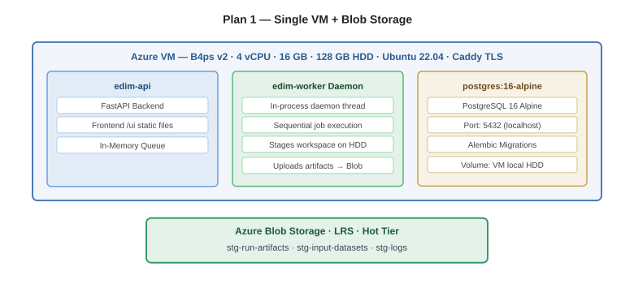
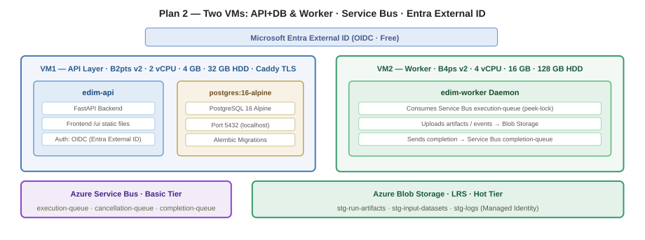

# EDIM — Azure Development Deployment Plans

This document presents two low-cost Azure configurations for the development review phase of the EDIM energy-development modeling platform. The objective is to put the model runtime and frontend online for stakeholder review at the lowest reasonable cost, with the ability to configure and execute live model.

> **On Spot Virtual Machines:** Azure Spot VMs offer unused datacenter capacity at discounts of 60–80% versus pay-as-you-go pricing. The trade-off is that Azure may evict the VM with 30 seconds' notice if capacity is needed elsewhere. For development workloads where occasional job loss is acceptable, Spot pricing provides the lowest possible compute cost. In this document, D4as v6 Spot is listed as an alternative for the model execution VM — at ~$28/mo versus ~$66/mo reserved. The `B4ps v2` option (1-year reserved) is recommended when predictable availability matters more than absolute minimum cost.

> **Pricing note:** All prices in this document are rough estimates based on Azure retail pricing (West Europe, USD) as of June 2026. Actual costs may vary depending on region, currency exchange rates, reservation terms, and Microsoft pricing changes. 

---

## 1. Plan 1: Single VM — Co-Located with Blob Storage External

**The cheapest possible configuration.** Ideal if the objective is to obtain stakeholder validation quickly and provide an environment for testing new implementations. Much faster to set up — a single VM, three Docker containers, no extra Azure services. No user authentication: the system uses the same test-user header shim as the offline proof of concept. Reviewers access the platform with pre-seeded identities.

### 1.1 Architecture

One VM runs all workloads. The API process hosts a background worker thread for sequential model execution. PostgreSQL runs alongside as a container. Only Blob Storage is external.

### 1.2 Resource Allocation

| Component | VM | Resources |
|---|---|---|
| API + Frontend | Same VM | FastAPI + `/ui` static files + Caddy TLS |
| Worker Thread | Daemon in API process | Sequential subprocess execution. In-memory queue. |
| PostgreSQL | Container, same VM | `postgres:16-alpine`, port 5432, local HDD volume |
| Blob Storage | External Azure | Artifacts, datasets, logs via Managed Identity |

### 1.3 Azure Resources

| Resource | Dev SKU | Specs | Monthly |
|---|---|---|---|
| VM | `Standard_B4ps_v2` | 4 vCPU, 16 GB | $65.54 (1yr reserved) |
| — alternative | `Standard_D4as_v6` Spot | 4 vCPU, 16 GB | $27.85 (Spot; evictable) |
| Managed Disk | `S10` Standard HDD | 128 GB | ~$6 |
| Public IP | Standard static | 1 | $4 |
| Blob Storage | LRS Hot | ~10 GB | $2 |
| **Total** | | | **$78 (B4ps v2) / $40 (Spot)** |

---

## 2. Plan 2: Two VMs — API+DB & Worker Separated, Service Bus Basic, Entra External ID

**Aligned with the final production architecture.** Worker isolation, durable messaging, and real user authentication via Microsoft Entra External ID. More complex to configure — two VMs, a Service Bus namespace, and an Entra tenant. The frontend needs basic login/logout process added. Infrastructure provisioning should begin as soon as possible to leave time for integration in order to comply with the deadline.

### 2.1 Architecture

**VM1 (API Layer):** API + frontend + PostgreSQL.
**VM2 (Worker):** Model execution daemon only. Zero database access.
**Service Bus Basic:** Three queues. First 13 million operations per month are free — effectively $0 for dev.
**Entra External ID:** OIDC auth, free for <50,000 MAU.

### 2.2 Resource Allocation

| Component | VM | Resources |
|---|---|---|
| API + Frontend | VM1 | FastAPI + `/ui` + Caddy TLS |
| PostgreSQL | VM1 (container) | `postgres:16-alpine`, port 5432, local HDD |
| Worker Daemon | VM2 | SB consumer → model CLI → Blob uploader |
| Service Bus | Azure Basic tier | execution-queue, cancellation-queue, completion-queue |
| Blob Storage | External Azure | Artifacts, datasets, logs |
| Entra External ID | Azure Free tier | OIDC token issuer, user sign-up/in |

### 2.3 Azure Resources

| Resource | Dev SKU | Specs | Monthly |
|---|---|---|---|
| VM1 (API+DB) | `Standard_B2pts_v2` | 2 vCPU, 1 GB | $4.11 (1yr reserved) |
| VM2 (Worker) | `Standard_B4ps_v2` | 4 vCPU, 16 GB | $65.54 (1yr reserved) |
| — alternative | `Standard_D4as_v6` Spot | 4 vCPU, 16 GB | $27.85 (Spot) |
| Disk VM1 | `S4` Standard HDD | 32 GB | ~$2 |
| Disk VM2 | `S10` Standard HDD | 128 GB | ~$6 |
| Public IP (VM1 only) | Standard static | 1 | $4 |
| Service Bus | Basic tier | 3 queues | $0 (<13M ops free) |
| Blob Storage | LRS Hot | ~10 GB | $2 |
| Entra External ID | Free tier | <50k MAU | $0 |
| **Total** | | | **$84 (B4ps v2) / $46 (Spot)** |

---

## 3. Plan Comparison

| | Plan 1 | Plan 2 |
|---|---|---|
| **Monthly (B4ps v2)** | $78 | $84 |
| **Monthly (Spot)** | $40 | $46 |
| **API VM** | Shared on worker VM | B2pts v2 ($4.11) |
| **Worker VM** | B4ps v2 / D4as v6 Spot | B4ps v2 / D4as v6 Spot |
| **Worker isolation** | Daemon thread in API process | Separate VM, zero DB access |
| **Queue** | In-memory | Service Bus Basic (free) |
| **Auth** | `X-EDIM-User-Id` header | Entra External ID (OIDC) |
| **Job durability** | Lost on VM restart | SB retains messages; retries |
| **Ops overhead** | Low (1 VM) | Medium (2 VMs, SB, Entra) |

---

## 4. VM SKU Selection Rationale

All prices sourced from [Azure Linux VM pricing](https://azure.microsoft.com/en-us/pricing/details/virtual-machines/linux/) (West Europe, USD).

### 4.1 Development — Worker / Compute

| SKU | vCPU | RAM | 1yr Reserved | Spot | Why |
|---|---|---|---|---|---|
| **B4ps v2** | 4 | 16 GB | **$65.54/mo** | $97.82/mo | Burstable B-series. CPU credits for bursty solver runs. Reliable. |
| **D4as v6** | 4 | 16 GB | $91.67/mo | **$27.85/mo** | 70% cheaper on Spot. Eviction risk. |

### 4.2 Development — API Layer

| SKU | vCPU | RAM | 1yr Reserved | Why |
|---|---|---|---|---|
| **B2pts v2** | 2 | 1 GB | **$4.11/mo** | Cheapest 2 vCPU SKU. Sufficient for API + Caddy. PostgreSQL uses ~200 MB. |

### 4.3 Storage — Standard HDD

| SKU | Size | Monthly | Rationale |
|---|---|---|---|
| S4 | 32 GB | ~$2 | API VM — OS + DB only |
| S10 | 128 GB | ~$6 | Worker / single VM — Docker images, run workspaces |

Sequential I/O. No premium storage needed. Run artifacts served from Blob, not local disk.

---

## 5. Production Target

The current baseline architecture (production-grade topology) costs approximately **$163/mo**:

| Layer | Azure Service | SKU | Monthly |
|---|---|---|---|
| Frontend | Static Web App | Free tier | $0 |
| API | App Service (Linux) | Basic B2 (2 vCPU, 3.5 GB) | $25.55 |
| Isolated Worker | VM | `Standard_B4s_v2` (4 vCPU, 16 GB) | $81.19 (1yr reserved) |
| Database | PostgreSQL Flexible Server | B1ms (1 vCPU, 2 GB) | $12.41 |
| Database storage | PostgreSQL Flexible Server | 10 GB | $1.15 |
| Message Queue | Service Bus | Free Tier | $0 |
| Object Storage | Blob Storage | LRS | ~$3 |
| Authentication | Entra External ID | Free (<50k MAU) | $0 |
| **Total** | | | **~$125/mo** |

All prices are billed upfront, year-based.

> Production prices sourced from [App Service Linux](https://azure.microsoft.com/en-us/pricing/details/app-service/linux/), [PostgreSQL Flexible Server](https://azure.microsoft.com/en-us/pricing/details/postgresql/flexible-server/), [Static Web Apps](https://azure.microsoft.com/en-us/pricing/details/app-service/static/), and [Linux VMs](https://azure.microsoft.com/en-us/pricing/details/virtual-machines/linux/) (June 2026). Please note that the Worker VM could be insufficient for higher loads and users count, and more suitable (and costly) VMs could be necessary. 

